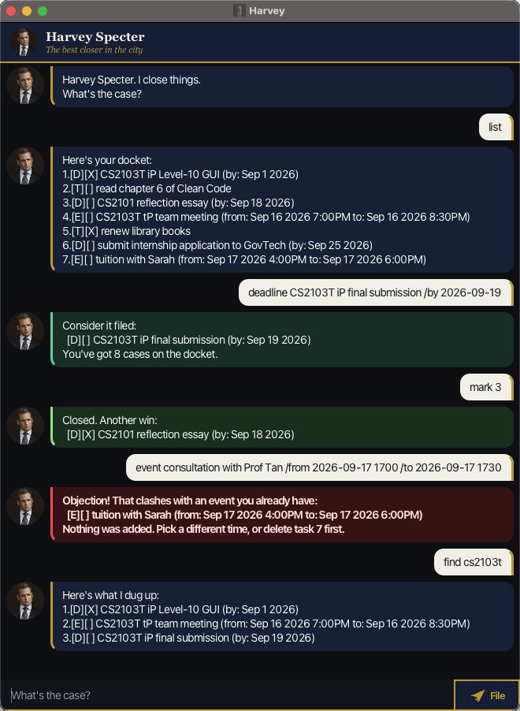

# Harvey User Guide



**Harvey** is a task manager you talk to. Instead of clicking through forms, you tell him
what's on your plate in one line of text, like `deadline CS2101 essay /by 2026-09-18`, and
he keeps track of your todos, deadlines and events. He's modelled on a confident corporate
lawyer: your tasks are *cases on the docket*, finishing one is *another win*, and when you
make a mistake he raises an *Objection!* and tells you how to fix it.

If you type faster than you click, Harvey will get your tasks down faster than a typical
to-do app.

- [Quick start](#quick-start)
- [Features](#features)
  - [Adding a todo: `todo`](#adding-a-todo-todo)
  - [Adding a deadline: `deadline`](#adding-a-deadline-deadline)
  - [Adding an event: `event`](#adding-an-event-event)
  - [Listing all tasks: `list`](#listing-all-tasks-list)
  - [Finding tasks: `find`](#finding-tasks-find)
  - [Marking a task as done: `mark`](#marking-a-task-as-done-mark)
  - [Marking a task as not done: `unmark`](#marking-a-task-as-not-done-unmark)
  - [Deleting a task: `delete`](#deleting-a-task-delete)
  - [Exiting: `bye`](#exiting-bye)
  - [Saving your tasks](#saving-your-tasks)
- [When something goes wrong](#when-something-goes-wrong)
- [FAQ](#faq)
- [Command summary](#command-summary)
- [Acknowledgements](#acknowledgements)

## Quick start

1. Make sure you have **Java 25** installed. To check, open a terminal and run
   `java -version`. The first line should mention version 25.
2. Download the latest `harvey.jar` from the
   [Releases page](https://github.com/Matcha1atte1/ip/releases).
3. Put `harvey.jar` in a folder of its own, e.g. `Documents/Harvey`. Harvey saves your
   tasks in a `data` folder next to wherever you run him, so a dedicated folder keeps them
   in one place.
4. Open a terminal in that folder and run:

   ```
   java -jar harvey.jar
   ```

   A window titled **Harvey** opens and greets you.
5. Type a command in the box at the bottom and press **Enter**, or click **File**. Try these:
   - `todo read chapter 6 of Clean Code` adds a todo.
   - `list` shows every task.
   - `mark 1` marks the first task as done.
   - `bye` closes Harvey.
6. See [Features](#features) below for every command.

## Features

**How to read the command formats**

- Words in `UPPER_CASE` are what you fill in. In `todo DESCRIPTION`, `DESCRIPTION` could be
  `read chapter 6 of Clean Code`.
- Command words work in any case: `list`, `LIST` and `List` all work.
- Extra spaces don't matter. `todo   read   book` is saved as `read book`.
- Dates are written `YYYY-MM-DD`, e.g. `2026-09-18`. Times use the 24-hour clock with no
  colon, e.g. `1900` for 7pm.
- `TASK_NUMBER` is the number shown next to the task by `list`.

Each task is shown with two boxes in front of it:

| Box | Meaning |
|---|---|
| `[T]`, `[D]` or `[E]` | Todo, deadline or event |
| `[X]` | Done |
| `[ ]` | Not done yet |

### Adding a todo: `todo`

Adds a task with no date attached.

Format: `todo DESCRIPTION`

Example: `todo read chapter 6 of Clean Code`

```
Consider it filed:
  [T][ ] read chapter 6 of Clean Code
You've got 1 case on the docket.
```

### Adding a deadline: `deadline`

Adds a task that must be done by a certain date.

Format: `deadline DESCRIPTION /by YYYY-MM-DD`

Example: `deadline CS2101 reflection essay /by 2026-09-18`

```
Consider it filed:
  [D][ ] CS2101 reflection essay (by: Sep 18 2026)
You've got 2 cases on the docket.
```

- The date must be a real date. `2026-02-30` is refused.
- Give `/by` exactly once.

### Adding an event: `event`

Adds something that happens over a stretch of time, like a meeting or a lesson.

Format: `event DESCRIPTION /from YYYY-MM-DD HHMM /to YYYY-MM-DD HHMM`

Example: `event CS2103T tP team meeting /from 2026-09-16 1900 /to 2026-09-16 2030`

```
Consider it filed:
  [E][ ] CS2103T tP team meeting (from: Sep 16 2026 7:00PM to: Sep 16 2026 8:30PM)
You've got 3 cases on the docket.
```

- `/from` must come before `/to`, and the event must end after it starts.
- **Harvey won't let two events overlap.** You can't be in two places at once, so an event
  that shares any time with one you already have is refused:

  ```
  Objection! That clashes with an event you already have:
    [E][ ] CS2103T tP team meeting (from: Sep 16 2026 7:00PM to: Sep 16 2026 8:30PM)
  Nothing was added. Pick a different time, or delete task 3 first.
  ```

  Events that only touch are fine: one ending at `2030` and another starting at `2030`
  don't clash.

### Listing all tasks: `list`

Shows every task, numbered in the order you added them.

Format: `list`

```
Here's your docket:
1.[T][ ] read chapter 6 of Clean Code
2.[D][ ] CS2101 reflection essay (by: Sep 18 2026)
3.[E][ ] CS2103T tP team meeting (from: Sep 16 2026 7:00PM to: Sep 16 2026 8:30PM)
```

These numbers are the `TASK_NUMBER`s that `mark`, `unmark` and `delete` use.

### Finding tasks: `find`

Shows the tasks whose description contains a word or phrase.

Format: `find KEYWORD`

Example: `find CS2103T`

```
Here's what I dug up:
1.[E][ ] CS2103T tP team meeting (from: Sep 16 2026 7:00PM to: Sep 16 2026 8:30PM)
```

- The search ignores case: `find cs2103t` finds `CS2103T`.
- Part of a word matches too: `find meet` finds `meeting`.
- Only descriptions are searched, not dates.

> **Note:** the results are numbered 1, 2, 3… *among the matches*. Those are not task
> numbers. Before you `mark` or `delete` a result, run `list` to get its real number.

### Marking a task as done: `mark`

Format: `mark TASK_NUMBER`

Example: `mark 2`

```
Closed. Another win:
  [D][X] CS2101 reflection essay (by: Sep 18 2026)
```

If the task is already done, Harvey tells you instead of marking it again, because you
probably meant a different number.

### Marking a task as not done: `unmark`

Format: `unmark TASK_NUMBER`

Example: `unmark 2`

```
Reopened. Don't make a habit of it:
  [D][ ] CS2101 reflection essay (by: Sep 18 2026)
```

### Deleting a task: `delete`

Removes a task for good. The tasks after it move up one number.

Format: `delete TASK_NUMBER`

Example: `delete 1`

```
Dropped. That one's off the table:
  [T][ ] read chapter 6 of Clean Code
You've got 2 cases on the docket.
```

### Exiting: `bye`

Format: `bye`

```
We're done here. Go win something.
```

The window closes a moment later, so you can read the goodbye. Type `bye` on its own:
`bye now` is refused, so a typo can't close Harvey by accident.

### Saving your tasks

There is no save command. Harvey saves after every change, to `data/harvey.txt` in the
folder you ran him from, and loads it again the next time he starts.

- **Keep running Harvey from the same folder.** If you start him from somewhere else, he
  looks for `data/harvey.txt` there, finds nothing, and starts with an empty list. Your tasks
  are still safe in the original folder.
- **Editing the file by hand** works if you keep its format, but take a copy first. Each
  line is one task, with fields separated by ` | `:

  ```
  T | 0 | read chapter 6 of Clean Code
  D | 1 | CS2101 reflection essay | 2026-09-18
  E | 0 | CS2103T tP team meeting | 2026-09-16 1900 | 2026-09-16 2030
  ```

  The second field is `1` for done and `0` for not done.
- **If part of the file can't be read**, Harvey loads everything he understands, tells you
  how many lines he skipped, and first saves a copy of the original next to it, named like
  `harvey.txt.20260913-162455.bak`. Nothing is lost: fix the line in the copy and put it
  back. If he can't make that copy either, he refuses to save rather than overwrite tasks he
  couldn't read.

## When something goes wrong

Whenever Harvey can't do what you asked, the reply turns **red** and starts with
**Objection!**, followed by what went wrong and usually an example of the right way to type
it. Nothing is added, changed or deleted.

| You typed | Harvey says |
|---|---|
| `lsit` | `Objection! I don't negotiate with gibberish like "lsit". I understand: bye, list, find, mark, unmark, delete, todo, deadline, event.` |
| `todo` | `Objection! A todo needs a description. For example: todo borrow book` |
| `deadline essay /by tomorrow` | `Objection! I could not read "tomorrow" as a date. Please write it as yyyy-mm-dd, for example 2019-10-15.` |
| `mark 9` when you have 3 tasks | `Objection! There is no task 9. You have 3 task(s), so pick a number from 1 to 3.` |
| a task you already have | `Objection! You already have that on the docket, as task 3: ...` |

Two tasks count as the same when they're the same kind, their descriptions match ignoring
case, and their dates are the same. The same essay due on two different dates is two tasks.

The `|` character can't be used anywhere in a task, because the save file uses it to
separate fields.

## FAQ

**Q: How do I move my tasks to another computer?**
A: Copy the `data` folder next to `harvey.jar` on the old computer into the folder you run
Harvey from on the new one.

**Q: Harvey opened with an empty list, but I had tasks yesterday.**
A: You probably started him from a different folder. Close him, then run
`java -jar harvey.jar` from the folder that contains your `data` folder.

**Q: Can I undo a `delete`?**
A: No. Add the task again, or, if you have a copy of `data/harvey.txt` from before, put that
copy back while Harvey is closed.

**Q: My computer isn't set to English. Will the dates look strange?**
A: No. Harvey always shows dates in English, e.g. `Sep 18 2026 7:00PM`.

## Command summary

| Action | Format | Example |
|---|---|---|
| Add a todo | `todo DESCRIPTION` | `todo read chapter 6 of Clean Code` |
| Add a deadline | `deadline DESCRIPTION /by YYYY-MM-DD` | `deadline CS2101 reflection essay /by 2026-09-18` |
| Add an event | `event DESCRIPTION /from YYYY-MM-DD HHMM /to YYYY-MM-DD HHMM` | `event tP meeting /from 2026-09-16 1900 /to 2026-09-16 2030` |
| List all tasks | `list` | `list` |
| Find tasks | `find KEYWORD` | `find CS2103T` |
| Mark as done | `mark TASK_NUMBER` | `mark 2` |
| Mark as not done | `unmark TASK_NUMBER` | `unmark 2` |
| Delete a task | `delete TASK_NUMBER` | `delete 1` |
| Exit | `bye` | `bye` |

## Acknowledgements

- The graphical interface (`Launcher`, `Main`, `MainWindow`, `DialogBox` and their FXML and
  CSS files) started from the SE-EDU
  [JavaFX tutorial](https://se-education.org/guides/tutorials/javaFx.html), and was then
  restyled and extended.
- Harvey's name and personality are inspired by the character Harvey Specter from the TV
  series *Suits*. This project is not affiliated with the show.
- Parts of the code, tests and this guide were written with the help of Claude (Anthropic),
  and reviewed and edited by the author.
<!-- TODO before publishing: credit the source of src/main/resources/images/Harvey.png
     (the avatar) and send.png (the button icon), or replace them. -->
